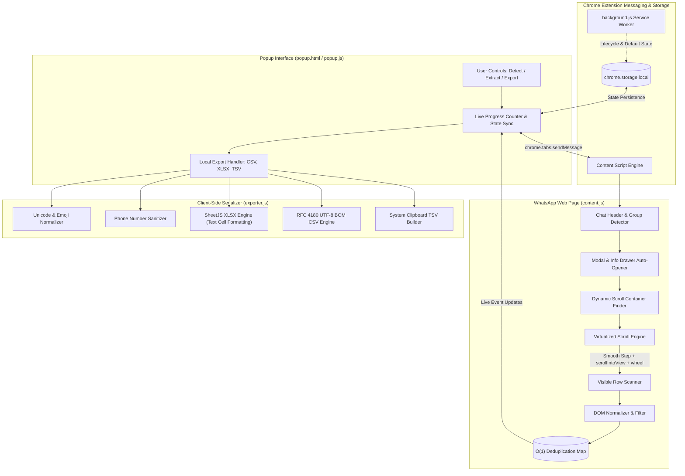

# WhatsApp Group Member Exporter 🚀

[](LICENSE)
[](#)
[](#)
[-teal.svg)](#)
[](#)

A production-quality **Chrome & Edge browser extension for WhatsApp Web** designed to seamlessly extract and export group participant information into **Excel (XLSX)**, **CSV**, or **Clipboard (TSV)**.

---

## 💡 Why This Project Exists

> Most commercial WhatsApp scraper extensions on the Chrome Web Store charge **$15–$30/month subscriptions**, force users to create accounts, or artificially cap free exports at **50 to 100 contacts**.
>
> **WhatsApp Group Member Exporter** was built to break those artificial walls:
> - **100% Free & Open-Source Forever**: No subscriptions, no tiers, no paywalls.
> - **No Artificial Limits**: Easily extracts **1,000+ to 2,000+ members** from large groups and communities.
> - **Zero Server Calls**: Operates 100% locally in your browser. Your contact data never touches any remote database or external API.
> - **No Credentials Required**: Uses only your existing, logged-in WhatsApp Web tab.

---

## 🏛 Architecture & Data Flow

The extension is designed around a clean, decoupled **Manifest V3** architecture that separates user interface state, DOM virtual scrolling, and offline spreadsheet serialization:



### Architectural Highlights

| Component | File | Responsibility |
| :--- | :--- | :--- |
| **Popup UI** | [`popup.html`](file:///f:/semester%207/IIC/Genesis/Group%20Member%20Scrapping%20Extension/popup.html), [`popup.js`](file:///f:/semester%207/IIC/Genesis/Group%20Member%20Scrapping%20Extension/popup.js), [`popup.css`](file:///f:/semester%207/IIC/Genesis/Group%20Member%20Scrapping%20Extension/popup.css) | Responsive interface with WhatsApp-inspired theme. Displays real-time progress (`X / Total found`), handles instant stop, triggers file downloads, and maintains state via `chrome.storage.local`. |
| **Virtual Scroll Engine** | [`content.js`](file:///f:/semester%207/IIC/Genesis/Group%20Member%20Scrapping%20Extension/content.js) | Inspects the WhatsApp Web DOM, locates the true scrolling ancestor via dynamic scroll testing, executes multi-action virtual scrolling (`scrollIntoView` + `wheel` + `scrollTop`), and recovers automatically if a container gets stuck. |
| **Data Exporter** | [`exporter.js`](file:///f:/semester%207/IIC/Genesis/Group%20Member%20Scrapping%20Extension/exporter.js) | Handles whitespace cleanup, Unicode/Indic/Arabic/emoji preservation, international phone normalization (`+<country><digits>`), Excel UTF-8 BOM CSV generation, and native XLSX creation via SheetJS. |
| **Service Worker** | [`background.js`](file:///f:/semester%207/IIC/Genesis/Group%20Member%20Scrapping%20Extension/background.js) | Lightweight Manifest V3 background service worker for installation events and storage initialization. |
| **Offline Library** | [`libs/xlsx.full.min.js`](file:///f:/semester%207/IIC/Genesis/Group%20Member%20Scrapping%20Extension/libs/xlsx.full.min.js) | Embedded offline SheetJS library to generate `.xlsx` spreadsheets entirely within the client without external CDN or network requests. |

---

## ✨ Features

- **Accurate Participant Extraction**:
  - **Display Name**: Preserves full Unicode, regional scripts (Tamil, Hindi, Arabic, Bengali, etc.), emojis, and punctuation.
  - **Phone Number**: Normalized to international format. If WhatsApp Web does not expose a number for a participant, it is cleanly marked as `Not available` (never fabricated).
  - **Role**: Automatically detects **Group Admins** and **Community Admins**.
- **Handles Large Groups (1,000+ Participants)**:
  - Specifically designed to handle virtualized lists where WhatsApp only mounts 15–25 rows in the DOM at any given moment.
  - Memory-efficient Map deduplication ensures zero lag even with thousands of entries.
- **Multiple Export Options**:
  - **XLSX (Excel)**: Formatted workbook with frozen header rows, autofilters, professional column widths, and phone numbers stored explicitly as string/text cells (`t: 's'`) so Excel doesn't drop `+` prefixes or corrupt numbers with scientific notation.
  - **CSV**: Encoded with UTF-8 BOM (`\uFEFF`) and RFC 4180 escaping so Excel and LibreOffice display international names and emojis without corrupted characters.
  - **Copy to Clipboard**: Instant tab-separated (TSV) format for one-click pasting into Google Sheets, Microsoft Excel, or Calc.
- **Safety & Privacy Controls**:
  - Operates strictly on the active WhatsApp Web tab.
  - Never reads personal messages, chat history, cookies, or account tokens.
  - An instant **Stop** button allows pausing extraction at any time while retaining all extracted data.

---

## 🚀 Installation Guide

### Google Chrome, Brave, Opera (Chromium)

1. Clone or download this repository:
   ```bash
   git clone https://github.com/MohamedNavith/whatsapp-group-member-exporter.git
   ```
2. Open your browser and navigate to:
   ```text
   chrome://extensions
   ```
3. Enable **Developer mode** using the toggle switch in the top-right corner.
4. Click **Load unpacked** in the top-left corner.
5. Select the project directory folder.
6. The extension is installed! Pin it to your toolbar for easy access.

### Microsoft Edge

1. Navigate to:
   ```text
   edge://extensions
   ```
2. Turn on the **Developer mode** toggle in the left sidebar.
3. Click **Load unpacked** and select the project directory.

---

## 📖 Usage Instructions

1. Open [https://web.whatsapp.com](https://web.whatsapp.com) and log in.
2. Click on the group conversation you wish to export.
3. Click the **WA Group Member Exporter** icon in your toolbar.
4. Click **Detect Group** to confirm the active group name.
5. Click **Extract Members**:
   - The extension will automatically open the participant list (or use it if already open).
   - It will scroll down through the virtualized list until all members are collected.
   - The live counter will track progress (e.g. `148 / 148`).
6. Click **Export XLSX**, **Export CSV**, or **Copy** to save your participant data.

---

## 📂 Repository Structure

```text
whatsapp-group-member-exporter/
│
├── manifest.json         # Chrome Manifest V3 configuration & permission boundaries
├── background.js        # Background service worker for extension lifecycle
├── content.js           # Virtualized scrolling & DOM inspection engine
├── exporter.js          # Unicode-safe normalization, SheetJS XLSX & CSV utilities
├── popup.html           # Modern popup interface
├── popup.css            # WhatsApp-inspired aesthetic with emerald theme
├── popup.js             # UI controller, tab communication & progress sync
├── test_suite.js        # Automated unit & verification test suite
├── .gitignore           # Clean git tracking rules
├── README.md            # Documentation & architecture guide
│
├── icons/
│   ├── icon16.png       # 16x16 toolbar icon
│   ├── icon48.png       # 48x48 extension manager icon
│   └── icon128.png      # 128x128 high-res icon
│
└── libs/
    └── xlsx.full.min.js # Standalone offline SheetJS library
```

---

## 🧪 Automated Testing

The repository includes a standalone test suite:

```bash
node test_suite.js
```

The test validates:
- Manifest V3 structure and permission limits.
- Unicode, Tamil, Hindi, Arabic, and emoji name normalization.
- International phone format normalization.
- UTF-8 BOM CSV generation with RFC 4180 escaping.
- SheetJS XLSX generation with text-formatted phone numbers and auto-filter.
- Clipboard TSV formatting.

---

## 🔒 Privacy & Terms of Use

- **Local Execution**: All processing occurs strictly within the local memory of your web browser.
- **Compliance**: This extension does not bypass WhatsApp privacy controls or access unexposed phone numbers. It simply automates the manual visual inspection of participant lists you are already permitted to view.
- **Notice**: This project is an independent open-source tool and is not affiliated with, endorsed by, or associated with WhatsApp LLC or Meta Platforms, Inc.

---

## 📄 License

This project is licensed under the [MIT License](LICENSE). Feel free to use, modify, and distribute for personal or commercial productivity.
